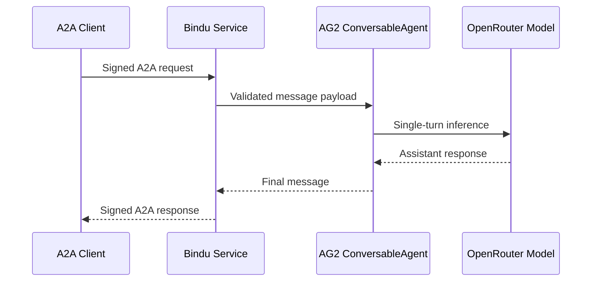

# Bindu Agent Demo

A minimal but production-shaped example that exposes an AG2 `ConversableAgent` through Bindu's A2A interface.

This project is intentionally small, but it includes the basics other users expect from a reusable sample:

- environment-based configuration
- safe defaults for local development
- a documented startup flow
- a checked-in `.env.example`
- a real `.gitignore`
- stateless request handling

## AG2 Features Used In This Example

This sample uses a narrow, intentional slice of AG2 so the integration stays easy to understand:

- `ConversableAgent` as the core assistant abstraction
- a `system_message` to define assistant behavior
- `llm_config` with a `config_list` to connect AG2 to the selected model provider
- a second `ConversableAgent` acting as a `user_proxy`
- `human_input_mode="NEVER"` so requests can run unattended in a service context
- `initiate_chat(...)` to execute a single-turn interaction
- `chat_history` inspection to extract the final assistant reply returned to Bindu

In short, the Bindu side handles transport, identity, and A2A exposure, while AG2 handles the agent abstraction and model conversation loop.

## What This Example Does

The service accepts incoming Bindu messages, extracts the latest user prompt, sends it to an AG2 agent, and returns the assistant response back through Bindu.



## Project Layout

```text
bindu-agent/
|-- .env.example
|-- .gitignore
|-- README.md
|-- main.py
|-- pyproject.toml
`-- uv.lock
```

## Requirements

- Python `3.12+`
- `uv` installed
- An OpenRouter API key

## Quick Start

1. Create and activate a virtual environment:

```powershell
uv venv
.\.venv\Scripts\Activate.ps1
```

2. Install dependencies:

```powershell
uv sync
```

3. Create your local environment file:

```powershell
Copy-Item .env.example .env
```

4. Add your OpenRouter API key to `.env`.

5. Start the agent service:

```powershell
uv run python main.py
```

You can also use the installed script entrypoint:

```powershell
uv run bindu-agent-demo
```

## Configuration

The example is configured entirely through environment variables.

| Variable | Required | Default | Purpose |
| --- | --- | --- | --- |
| `OPENROUTER_API_KEY` | Yes | None | API key used by AG2 to call OpenRouter |
| `OPENROUTER_MODEL` | No | `anthropic/claude-3-haiku` | Model passed to the AG2 config |
| `OPENROUTER_BASE_URL` | No | `https://openrouter.ai/api/v1` | OpenRouter API base URL |
| `BINDU_AGENT_AUTHOR` | No | `ag2.developer@example.com` | Metadata shown by the Bindu service |
| `BINDU_AGENT_NAME` | No | `ag2-networked-assistant` | Service name |
| `BINDU_AGENT_DESCRIPTION` | No | Built-in description | Service description |
| `BINDU_AGENT_URL` | No | `http://localhost:3773` | Service bind or advertised URL |
| `BINDU_AGENT_EXPOSE` | No | `false` | Enables Bindu tunneling when set to `true` |
| `LOG_LEVEL` | No | `INFO` | Python logging level |

## Why This Example Is Safe To Copy

- Secrets are loaded from `.env` instead of being hardcoded.
- The process fails fast if `OPENROUTER_API_KEY` is missing.
- A new AG2 agent pair is created per request, which keeps the service stateless.
- External exposure is off by default.
- Logging is structured enough for local debugging and basic deployment logs.

## Customization Points

- Change the AG2 system prompt in `main.py` to match your use case.
- Replace the default model through `OPENROUTER_MODEL`.
- Add Bindu skills to the `skills` list in `build_bindu_config()`.
- Expand `handler()` if you want multi-turn memory, tools, or richer payload validation.
- Swap the simple `ConversableAgent` setup for a richer AG2 workflow if you want tools, group chat, or longer reasoning chains.

## Development Notes

- `uv.lock` is committed so installs are reproducible.
- `.env` is intentionally ignored by git.
- `logs/`, `build/`, `.venv/`, and Python cache files are ignored as well.

## Troubleshooting

### `OPENROUTER_API_KEY is not set`

Create `.env` from `.env.example` and set a valid key.

### Agent starts but does not answer usefully

Check:

- the selected OpenRouter model exists for your account
- the API key is valid
- the AG2 system prompt matches the behavior you expect

### Need to expose the agent outside localhost

Set `BINDU_AGENT_EXPOSE=true` only after you are comfortable exposing the service and understand the network implications.

## Next Steps

If you want to turn this sample into a real service, the next production upgrades are:

- add automated tests around `handler()`
- add request and response schema validation
- add health checks and structured error handling
- move model and prompt selection into deployment config
