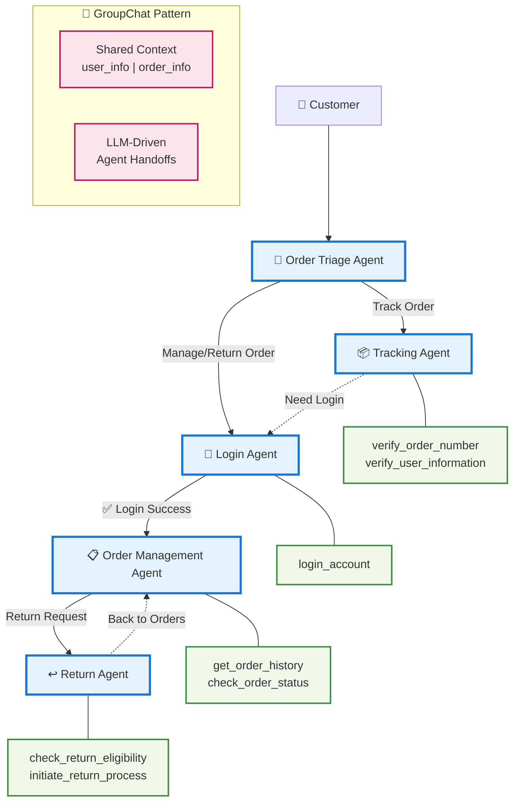

# 🛒 E-Commerce Customer Service with Order Management

- By [yiranwu0](https://github.com/yiranwu0)
- Last revision: 26/05/2024 by [willhama](https://github.com/willhama)
- Last revision: 20/09/2024 by [qingyun-wu](https://github.com/qingyun-wu): added uv support and enhance docs

This project demonstrates a robust and flexible order management system using decentralized agent orchestration. The system addresses two primary user needs: order tracking and order returns. The workflow considers the user's login status during the initial interaction. Users can quickly track an order using a tracking number without logging in, while returns require authentication. This system leverages modular agents for triaging, tracking, login management, order management, and returns, ensuring a seamless user experience.

## 🤖 AG2 Features

This project demonstrates the following AG2 features:

- [Group Chat](https://docs.ag2.ai/latest/docs/user-guide/advanced-concepts/orchestration/group-chat/introduction/#purpose-and-benefits)

## 🏗️ System Architecture

### Agent Flow Visualization

The system uses a decentralized agent orchestration pattern with the following agent flow:



## 🏷️ Tags

`groupchat` `e-commerce` `order-management` `customer-service` `order-tracking` `returns-processing` `authentication` `workflow-automation` `agent-orchestration`


## 📋 Description

### Agents and Workflow

The system initializes context variables with two fields: `user_info` to store user information (and order list when a user logs in) and `order_info` to store the retrieved order information. Since group chat is a decentralized orchestration, the transfer logic is distributed across each agent:

#### 🎯 Order Triage Agent
Routes order-related messages to the appropriate agent. Decides whether to transfer to the Tracking Agent or the Login Agent based on user intent.

#### 📦 Tracking Agent
Enables users to track orders without logging in. First requests a tracking number, then asks for additional verification information (email or phone number) to confirm identity. Can transfer to the Login Agent if order management is needed.

**Tools:**
- `verify_tracking_number` - Verifies if the tracking number is valid and updates context variables with order info
- `verify_user_information` - Validates user information and returns order details if correct

#### 🔐 Login Agent
Handles user authentication with the `login_account` tool. Upon successful login, updates context variables with user info and transfers to the Order Management Agent. Can guide users through retry or account recovery processes. Currently uses a mock login system for demonstration.

**Tools:**
- `login_account` - Authenticates user credentials and updates context

#### 📋 Order Management Agent
General-purpose agent for authenticated users with access to complete order history. Uses `get_order_history` and `check_order_status` tools to help users find and check past orders. Can transfer to the Return Agent for order returns.

**Tools:**
- `get_order_history` - Retrieves complete order history for authenticated users
- `check_order_status` - Checks status of specific orders

#### ↩️ Return Agent
Manages the order return process. Verifies return eligibility with `check_return_eligibility` and initiates returns with `initiate_return_process` upon user confirmation. Can transfer back to the Order Management Agent as needed.

**Tools:**
- `check_return_eligibility` - Verifies if an order is eligible for return
- `initiate_return_process` - Starts the return process for eligible orders

## ⚙️ Installation

1. Install dependencies using uv:

```bash
uv sync
```

2. Set up environment variables:

```bash
cp .env.example .env
# Edit .env with your API key
```

The primary dependency is the `ag2` library.

## 🚀 Run the code

```bash
uv run python main.py
```

The system will start running, and you can interact with it through the command line.

### 📝 Example Interactions

**Example Interaction 1: Cancel orders**

1. `I want to cancel my order`
2. `TR14234`
3. .. Continue to interact with the system ..

**Example Interaction 2: Track orders**

1. `I want to track my order`
2. `TR13845`
3. `8453` (last 4 digits of phone number)
4. .. Continue to interact with the system ..

## 📞 Contact

For more information or any questions, please refer to the documentation or reach out to us!

- View Documentation at: https://docs.ag2.ai/latest/
- Find AG2 on github: https://github.com/ag2ai/ag2
- Join us on Discord: https://discord.gg/pAbnFJrkgZ

## 📄 License

This project is licensed under the Apache License 2.0. See the [LICENSE](../LICENSE) for details.
