# 📊 Financial Analysis of a Given Stock

- By [yiranwu0](https://github.com/yiranwu0)
- Last revision: 06/06/2025 by [willhama](https://github.com/willhama)
- Last revision: 09/20/2025 by [qingyun-wu](https://github.com/qingyun-wu): added uv support
- This project referenced the AG2 notebook [task solving with code generation, execution, and debugging](https://docs.ag2.ai/notebooks/agentchat_auto_feedback_from_code_execution#a-comparative-analysis-of-meta-and-tesla-stocks-in-early-2024)

This project retrieves news and stock price changes for a given stock symbol (e.g., AAPL) and generates a summarized market analysis report.

## 🏗️ System Architecture

### Agent Flow Visualization

The system uses specialized agents working in parallel and sequential phases for comprehensive financial analysis:

```mermaid
flowchart TD
    A["👤 User Input<br/>(Stock Symbol)"] --> B["🔄 Async Task Orchestration"]

    %% Parallel Phase
    B --> C["📰 Financial Assistant"]
    B --> D["🔬 Research Assistant"]

    %% Agent Tasks
    C --> E["📊 News Retrieval<br/>& Analysis"]
    D --> F["📈 Stock Price<br/>Analysis & Plotting"]

    %% Tools
    E --- TC["get_news_links<br/>summarize_news"]
    F --- TD["Python Code Execution<br/>Data Visualization"]

    %% Convergence Phase
    E --> G["📝 Report Writer"]
    F --> G
    G --> H["📋 Market Analysis<br/>Report Generation"]

    H --> I["💼 Investment<br/>Recommendation<br/>(Buy/Sell/Hold)"]

    %% Styling
    classDef agent fill:#e8f5e8,stroke:#28a745,stroke-width:3px
    classDef process fill:#e3f2fd,stroke:#1976d2,stroke-width:2px
    classDef tools fill:#fff3cd,stroke:#ffc107,stroke-width:2px
    classDef output fill:#f8d7da,stroke:#721c24,stroke-width:2px

    class C,D,G agent
    class A,B,E,F,H process
    class TC,TD tools
    class I output
```



### Agent Roles & Responsibilities

| Agent | Role | Tools & Capabilities |
|-------|------|---------------------|
| 📰 **Financial Assistant** | News retrieval and financial data collection. Gathers recent market news and performs initial analysis of market sentiment. | • get_news_links - Retrieves Yahoo Finance news<br>• summarize_news - Extracts key information from articles |
| 🔬 **Research Assistant** | Quantitative analysis including stock price trends, technical indicators, and data visualization through Python code execution. | • Python Code Execution<br>• Data Visualization (matplotlib/pandas)<br>• Price Change Calculations |
| 📝 **Report Writer** | Synthesizes findings from news analysis and price research to generate comprehensive market analysis reports with investment recommendations. | • Report Synthesis<br>• Investment Decision Logic<br>• Markdown Report Generation |
| 🤖 **User Proxy** | Orchestrates the entire workflow, manages code execution environment, and coordinates async communication between agents. | • Async Task Coordination<br>• Code Execution Management<br>• Workflow Orchestration |

## 📋 Details

### 🔄 Analysis Workflow

1. **Step 1 - News Collection:** Retrieves 5 recent news articles from Yahoo Finance for the specified stock
2. **Step 2 - Price Analysis:** Gathers Monthly, 3-month, YTD, and 1-year stock price changes using Python code
3. **Step 3 - Visualization:** Creates and saves a 1-year stock price change graph as PNG
4. **Step 4 - Report Generation:** Produces comprehensive market analysis report in Markdown format
5. **Step 5 - Decision Support:** Provides investment recommendation (Buy/Sell/Hold) with supporting analysis

> **⚠️ Disclaimer:** This analysis is for demonstration purposes only and should not be considered as financial advice. Always consult with financial professionals before making investment decisions.

## AG2 Features

This project uses the following AG2 features:

- [Using Tools](https://docs.ag2.ai/docs/user-guide/basic-concepts/tools)
- [Async Initiate Chat and Chat Summary](https://docs.ag2.ai/docs/api-reference/autogen/ConversableAgent#a-initiate-chat)

## TAGS

financial analysis, tool-use, async chat, stock-market, data-visualization, news-retrieval, investment-analysis, decision-support, market-trends

## Installation

1. Install dependencies using uv:

```bash
uv sync
```

2. Set up environment variables:

```bash
cp .env.example .env
# Edit .env with your API key
```

The primary dependency is the `ag2` library.

## Run the code

Before running the demo, you need to set up your OpenAI API configuration:


## Run the Demo

```bash
uv run python main.py
```

At the `Enter the stock you want to investigate: ` prompt, enter the stock symbol or stock name you want to investigate. For example, you can enter `AAPL` for Apple Inc. stock.

Checkout the generated `market_analysis_report.md` file for the summarized market analysis report.

## Contact

For more information or any questions, please refer to the documentation or reach out to us!

- View Documentation at: https://docs.ag2.ai/latest/
- Find AG2 on github: https://github.com/ag2ai/ag2
- Join us on Discord: https://discord.gg/pAbnFJrkgZ
- Email us at: support@ag2.ai

## License

This project is also licensed under the Apache License 2.0 [LICENSE](../LICENSE).
